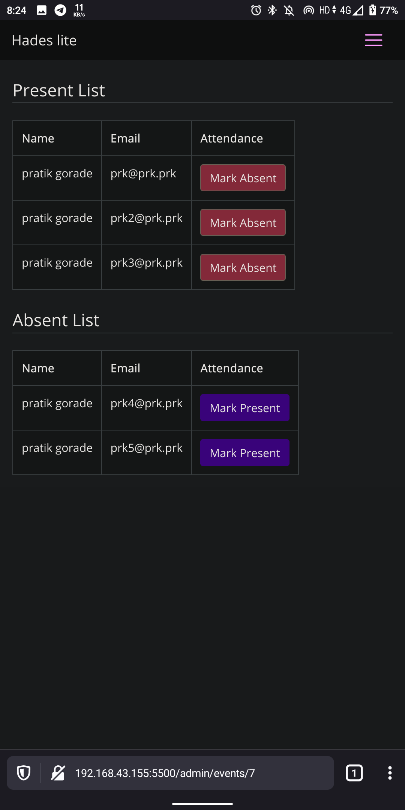

# Hades 

Smol event management system for smol and free type events created using flask and sqlight (and bootstrap cause manual css is pain) that dosn't require db changes or form addition by creating more html code

This is my attempt of creating an event management system with following features

1. Multiple people can register as admin and each admin can create a generic event by filling event details in form
2. Only event creator can access the list of event participant (Planned feature : option of giving event access (view only and edit) to other admins and editing event details after event creation)
3. Marking the participant presnt or absent
4. admins can change their name, email and password (Planned feature : forgot password feature and email verification)
5. Master user manages the admin accounts and he can delete the admin accounts as well. but he cannot access their events 
6. Site home will list all the upcoming events sorted by date and user can select event to fill the participation form 

### how to run

```bash
python3.8 -m venv ./venv
source venv/bin/activate
pip install -U -r requirements.txt
cp example.env .env
gunicorn hades:app -b 0.0.0.0:5500
```

# Screenshots

## Login Screen


## Dropdown Menu


## Update Username Password


## User Management (Master Admin only)


## Add Event (Admin Only)


## View Events (Admin Users)


## Participents and Attendence (Event Creator Admin only)


## Upcoming Events (Normal User)

